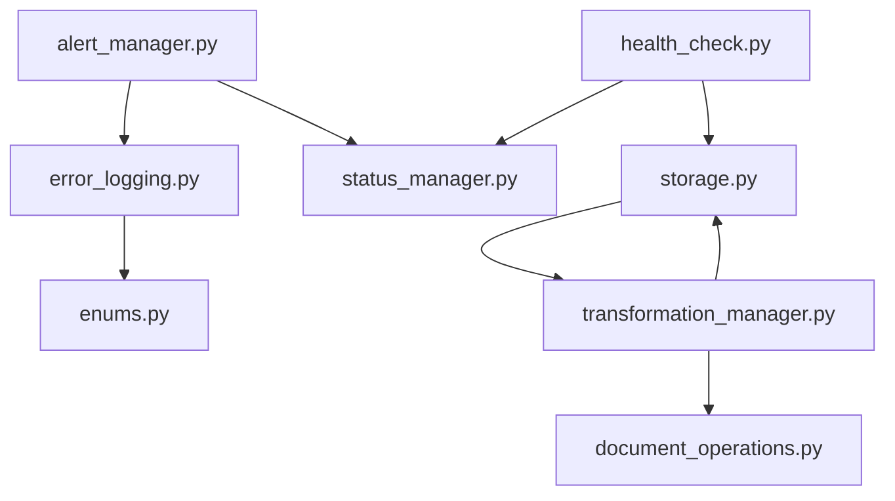

# Source Tracking Dependencies Analysis

## Overview

This document outlines the dependencies and relationships between source tracking components as part of the IndexForge migration project.

## Module Dependencies

### Core Components

1. Source Tracking Core (`src/connectors/direct_documentation_indexing/source_tracking/`)

   - `alert_manager.py` → Depends on:

     - `error_logging.py`
     - `status_manager.py`
     - External: Redis for alert storage

   - `error_logging.py` → Depends on:

     - `enums.py`
     - External: Logging infrastructure

   - `health_check.py` → Depends on:

     - `status_manager.py`
     - `storage.py`
     - External: Monitoring system

   - `storage.py` → Depends on:

     - `transformation_manager.py`
     - External: Document store

   - `transformation_manager.py` → Depends on:
     - `storage.py`
     - `document_operations.py`

### External Service Dependencies

1. Storage Services:

   - Redis (Caching, Alert Storage)
   - Document Store (Primary Storage)
   - Vector Store (Weaviate)

2. Messaging Services:

   - RabbitMQ (Event Bus)

3. Monitoring:
   - Prometheus (Metrics)
   - Logging Infrastructure

## Import Graph

## Version Requirements

1. Python Dependencies:

   - Python >= 3.11
   - FastAPI latest
   - Pydantic v2
   - Redis-py latest

2. External Services:
   - Redis >= 6.0
   - RabbitMQ >= 3.8
   - Weaviate latest

## Potential Circular Dependencies

1. Identified:

   - `storage.py` ↔ `transformation_manager.py`

2. Resolution Strategy:
   - Extract common interfaces to break circular dependency
   - Move shared logic to new module
   - Implement dependency injection

## Migration Considerations

1. Breaking Changes:

   - Alert manager interface updates
   - Storage service abstraction
   - Monitoring integration changes

2. Backward Compatibility:
   - Maintain old interfaces during transition
   - Implement feature flags for new functionality
   - Provide migration utilities

## Backup Status

Location: `/Users/davidleathers/Desktop/Development/indexforge/backup`

- `src/`: Source code backup
- `weaviate/`: Database backup

## Next Steps

1. Dependency Resolution:

   - Break identified circular dependencies
   - Extract common interfaces
   - Implement dependency injection

2. Version Updates:

   - Update all dependencies to required versions
   - Test compatibility
   - Document any breaking changes

3. Migration Path:
   - Create detailed migration guide
   - Implement feature flags
   - Add migration utilities
