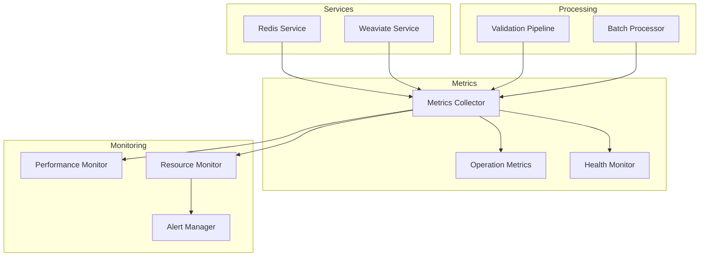
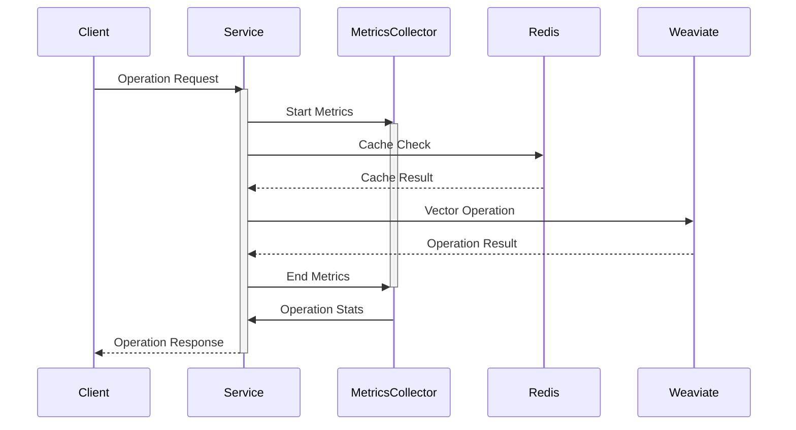
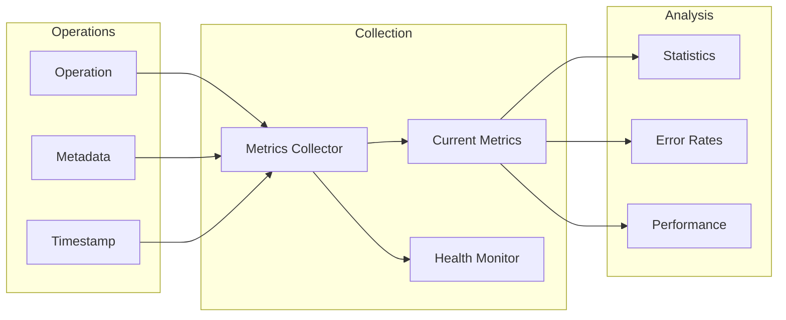
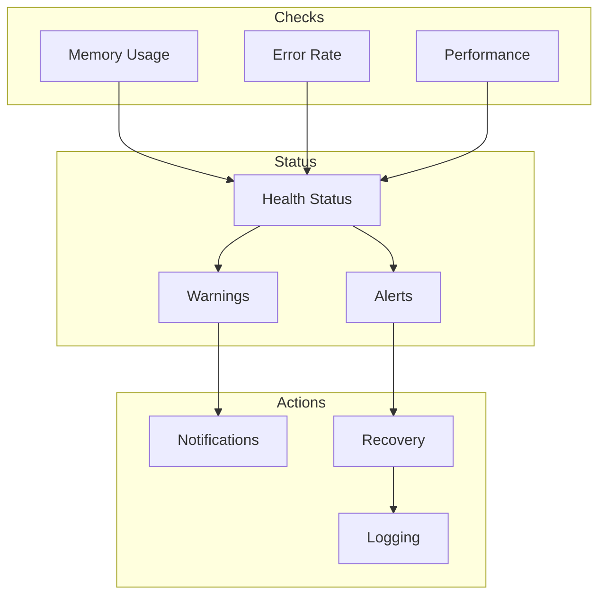
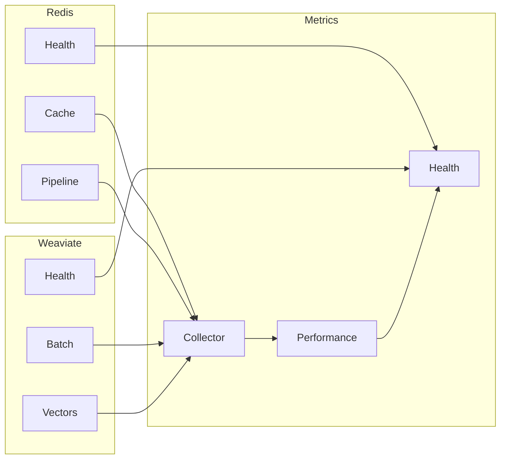
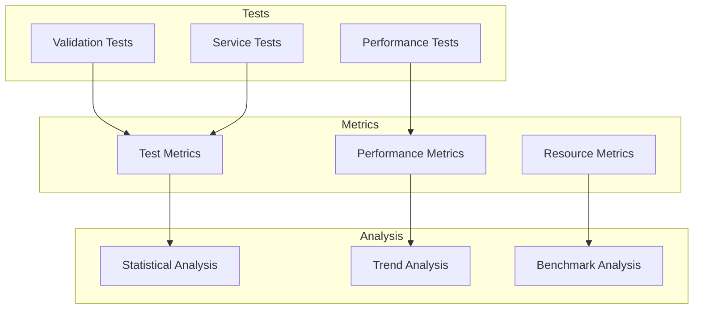

# System Architecture Diagrams

## Core Components

```mermaid
graph TB
    subgraph Services
        RS[Redis Service]
        WS[Weaviate Service]
    end

    subgraph Metrics
        MC[Metrics Collector]
        OM[Operation Metrics]
        HM[Health Monitor]
    end

    subgraph Processing
        VP[Validation Pipeline]
        BP[Batch Processor]
    end

    subgraph Monitoring
        PM[Performance Monitor]
        RM[Resource Monitor]
        AM[Alert Manager]
    end

    MC --> OM
    MC --> HM
    RS --> MC
    WS --> MC
    VP --> MC
    BP --> MC
    MC --> PM
    MC --> RM
    RM --> AM
```

## Data Flow

```mermaid
sequenceDiagram
    participant C as Client
    participant S as Service
    participant MC as MetricsCollector
    participant R as Redis
    participant W as Weaviate

    C->>S: Operation Request
    activate S
    S->>MC: Start Metrics
    activate MC
    S->>R: Cache Check
    R-->>S: Cache Result
    S->>W: Vector Operation
    W-->>S: Operation Result
    S->>MC: End Metrics
    deactivate MC
    MC->>S: Operation Stats
    S-->>C: Operation Response
    deactivate S
```

## Metrics Collection

```mermaid
graph LR
    subgraph Operations
        OP[Operation]
        MT[Metadata]
        TS[Timestamp]
    end

    subgraph Collection
        MC[Metrics Collector]
        CM[Current Metrics]
        HM[Health Monitor]
    end

    subgraph Analysis
        ST[Statistics]
        ER[Error Rates]
        PF[Performance]
    end

    OP --> MC
    MT --> MC
    TS --> MC
    MC --> CM
    MC --> HM
    CM --> ST
    CM --> ER
    CM --> PF
```

## Health Monitoring

```mermaid
graph TB
    subgraph Checks
        MU[Memory Usage]
        ER[Error Rate]
        PF[Performance]
    end

    subgraph Status
        HS[Health Status]
        WN[Warnings]
        AL[Alerts]
    end

    subgraph Actions
        NT[Notifications]
        RC[Recovery]
        LG[Logging]
    end

    MU --> HS
    ER --> HS
    PF --> HS
    HS --> WN
    HS --> AL
    WN --> NT
    AL --> RC
    RC --> LG
```

## Service Integration

```mermaid
graph LR
    subgraph Redis
        RC[Cache]
        RP[Pipeline]
        RH[Health]
    end

    subgraph Weaviate
        WB[Batch]
        WV[Vectors]
        WH[Health]
    end

    subgraph Metrics
        MC[Collector]
        MP[Performance]
        MH[Health]
    end

    RC --> MC
    RP --> MC
    RH --> MH
    WB --> MC
    WV --> MC
    WH --> MH
    MC --> MP
    MP --> MH
```

## Performance Testing

```mermaid
graph TB
    subgraph Tests
        VT[Validation Tests]
        ST[Service Tests]
        PT[Performance Tests]
    end

    subgraph Metrics
        TM[Test Metrics]
        PM[Performance Metrics]
        RM[Resource Metrics]
    end

    subgraph Analysis
        SA[Statistical Analysis]
        TA[Trend Analysis]
        BA[Benchmark Analysis]
    end

    VT --> TM
    ST --> TM
    PT --> PM
    TM --> SA
    PM --> TA
    RM --> BA
```
