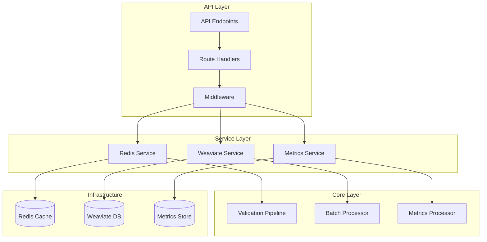
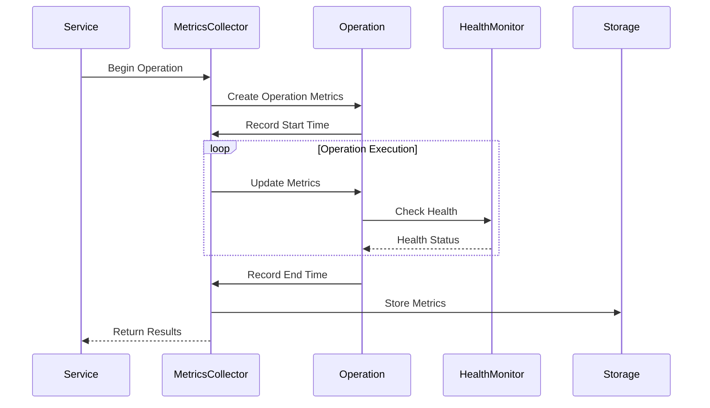
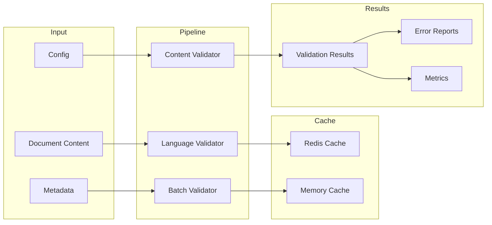
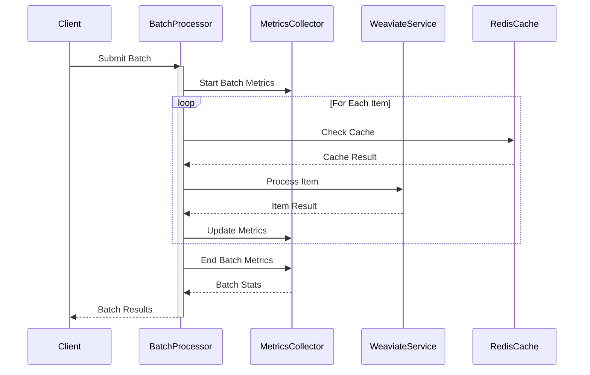
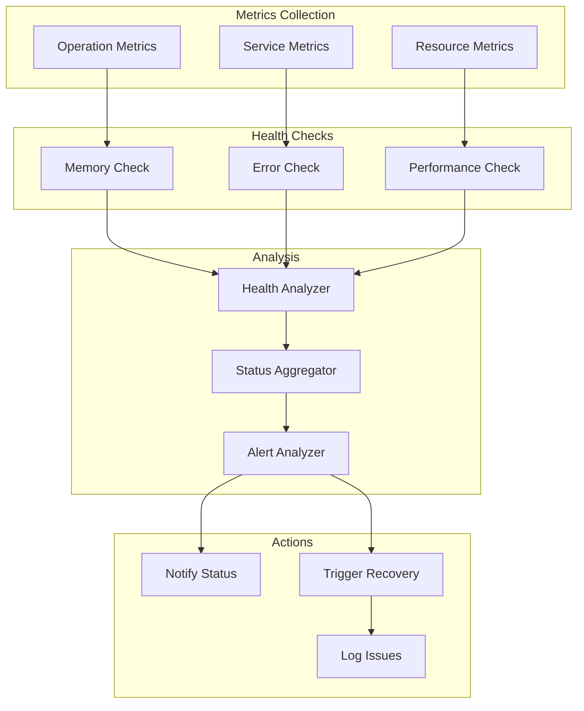
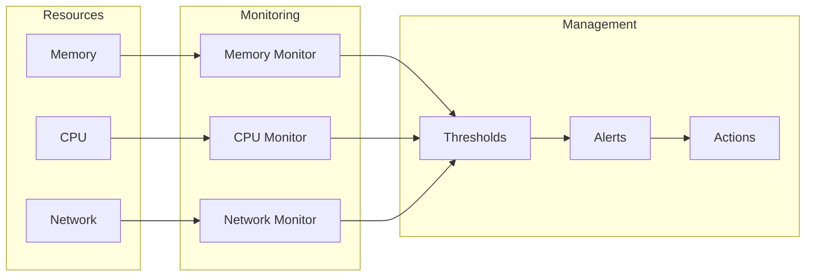

# Component Interactions

## Service Layer Interactions

```mermaid
graph TB
    subgraph API Layer
        API[API Endpoints]
        RO[Route Handlers]
        MW[Middleware]
    end

    subgraph Service Layer
        RS[Redis Service]
        WS[Weaviate Service]
        MS[Metrics Service]
    end

    subgraph Core Layer
        VP[Validation Pipeline]
        BP[Batch Processor]
        MP[Metrics Processor]
    end

    subgraph Infrastructure
        RC[(Redis Cache)]
        WD[(Weaviate DB)]
        MM[(Metrics Store)]
    end

    API --> RO
    RO --> MW
    MW --> RS
    MW --> WS
    MW --> MS
    RS --> RC
    WS --> WD
    MS --> MM
    RS --> VP
    WS --> BP
    MS --> MP
```

## Metrics Flow

```mermaid
sequenceDiagram
    participant SVC as Service
    participant MC as MetricsCollector
    participant OP as Operation
    participant HM as HealthMonitor
    participant ST as Storage

    SVC->>MC: Begin Operation
    MC->>OP: Create Operation Metrics
    OP->>MC: Record Start Time

    loop Operation Execution
        MC->>OP: Update Metrics
        OP->>HM: Check Health
        HM-->>OP: Health Status
    end

    OP->>MC: Record End Time
    MC->>ST: Store Metrics
    MC-->>SVC: Return Results
```

## Validation Pipeline

```mermaid
graph LR
    subgraph Input
        DC[Document Content]
        MD[Metadata]
        CF[Config]
    end

    subgraph Pipeline
        LV[Language Validator]
        BV[Batch Validator]
        CV[Content Validator]
    end

    subgraph Cache
        RC[Redis Cache]
        MC[Memory Cache]
    end

    subgraph Results
        VR[Validation Results]
        ER[Error Reports]
        MT[Metrics]
    end

    DC --> LV
    MD --> BV
    CF --> CV
    LV --> RC
    BV --> MC
    CV --> VR
    VR --> ER
    VR --> MT
```

## Batch Processing

```mermaid
sequenceDiagram
    participant CL as Client
    participant BP as BatchProcessor
    participant MC as MetricsCollector
    participant WS as WeaviateService
    participant RC as RedisCache

    CL->>BP: Submit Batch
    activate BP
    BP->>MC: Start Batch Metrics

    loop For Each Item
        BP->>RC: Check Cache
        RC-->>BP: Cache Result
        BP->>WS: Process Item
        WS-->>BP: Item Result
        BP->>MC: Update Metrics
    end

    BP->>MC: End Batch Metrics
    MC-->>BP: Batch Stats
    BP-->>CL: Batch Results
    deactivate BP
```

## Health Monitoring Flow

```mermaid
graph TB
    subgraph Metrics Collection
        OM[Operation Metrics]
        SM[Service Metrics]
        RM[Resource Metrics]
    end

    subgraph Health Checks
        MC[Memory Check]
        EC[Error Check]
        PC[Performance Check]
    end

    subgraph Analysis
        HA[Health Analyzer]
        SA[Status Aggregator]
        AA[Alert Analyzer]
    end

    subgraph Actions
        NS[Notify Status]
        TR[Trigger Recovery]
        LI[Log Issues]
    end

    OM --> MC
    SM --> EC
    RM --> PC
    MC --> HA
    EC --> HA
    PC --> HA
    HA --> SA
    SA --> AA
    AA --> NS
    AA --> TR
    TR --> LI
```

## Resource Management

```mermaid
graph LR
    subgraph Resources
        MEM[Memory]
        CPU[CPU]
        NET[Network]
    end

    subgraph Monitoring
        MM[Memory Monitor]
        CM[CPU Monitor]
        NM[Network Monitor]
    end

    subgraph Management
        TH[Thresholds]
        AL[Alerts]
        AC[Actions]
    end

    MEM --> MM
    CPU --> CM
    NET --> NM
    MM --> TH
    CM --> TH
    NM --> TH
    TH --> AL
    AL --> AC
```
