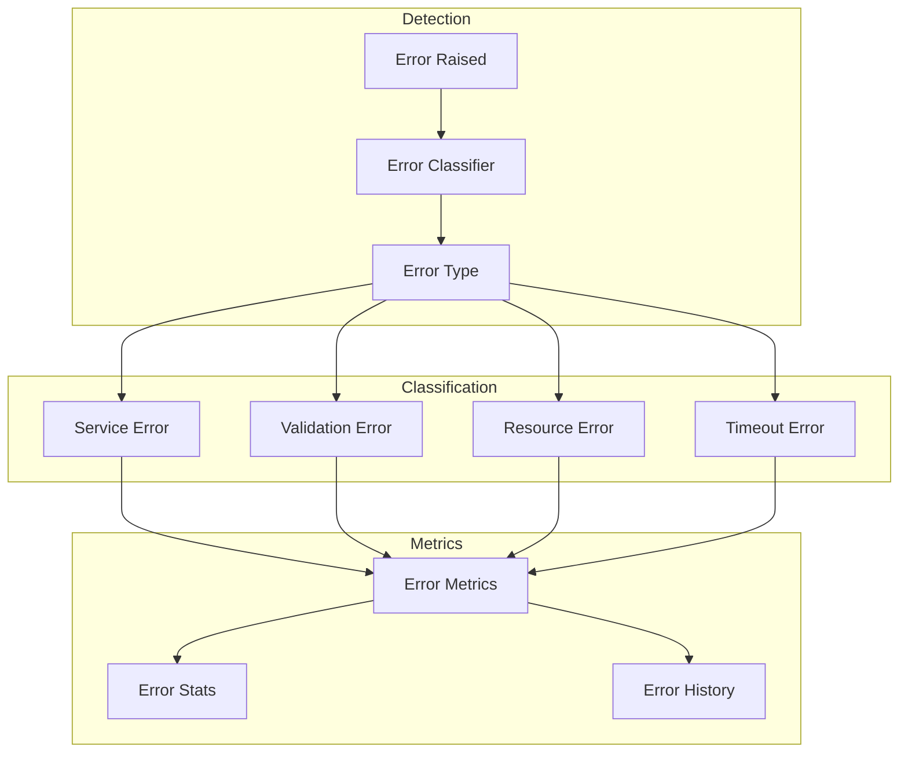
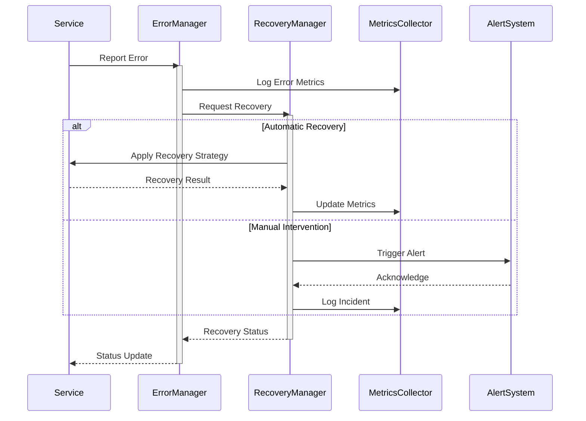
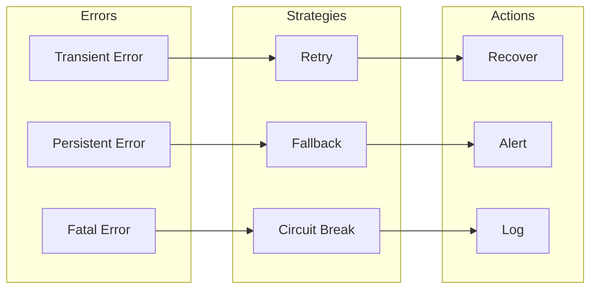
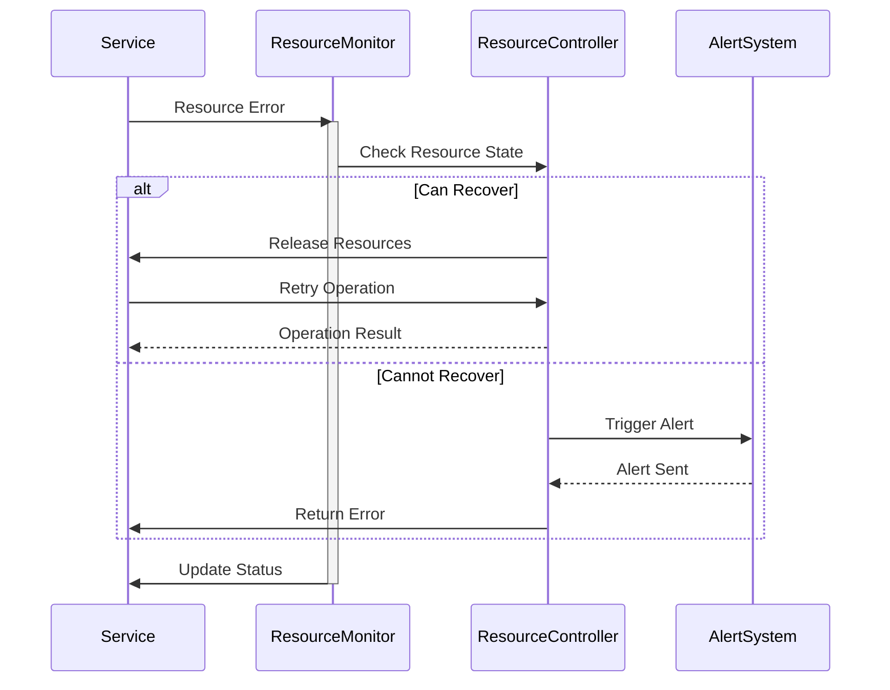
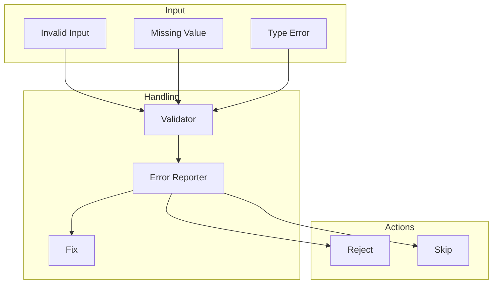
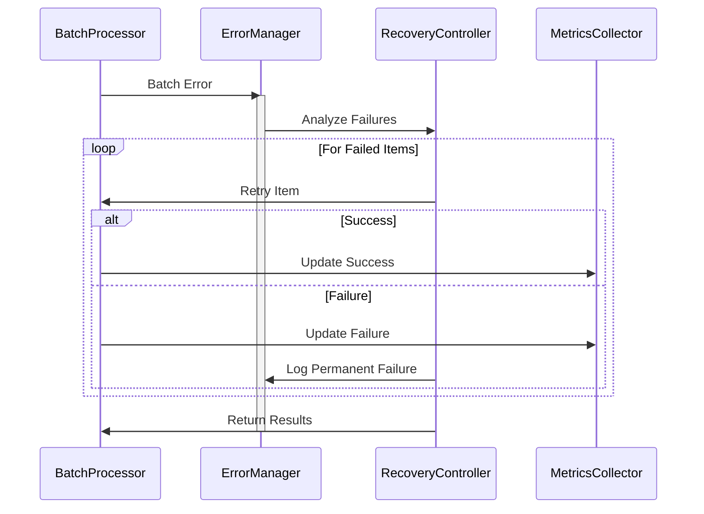
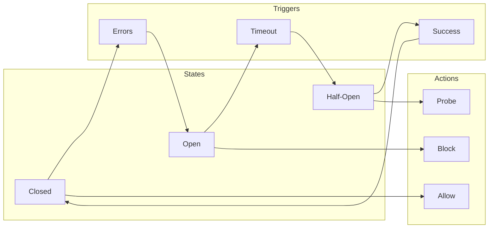
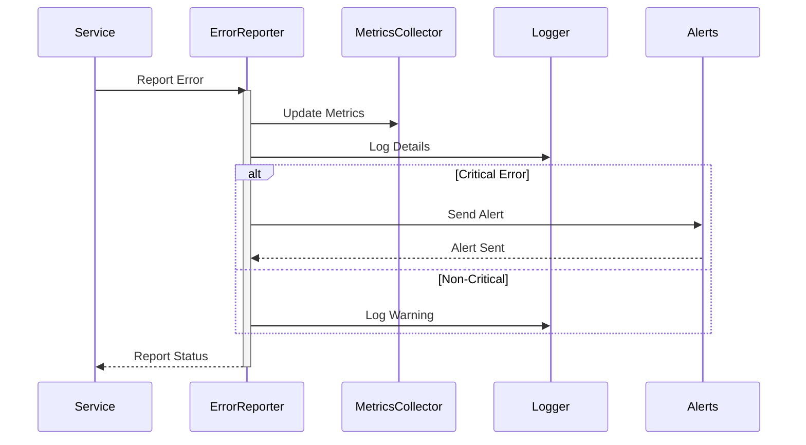

# Error Handling and Recovery Flows

## Error Detection and Classification

## Service Recovery Flow

## Error Handling Strategy

## Resource Error Recovery

## Validation Error Handling

## Batch Error Recovery

## Circuit Breaker Pattern

## Error Reporting Flow

