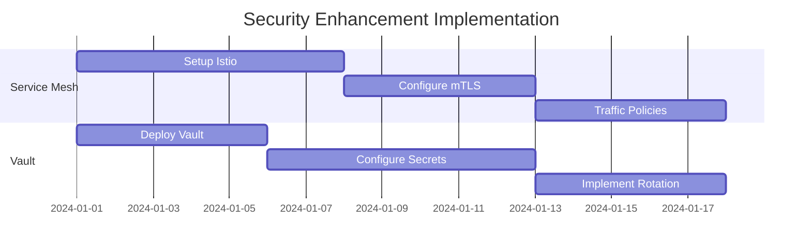

# Phase 5: Security Enhancements Analysis and Implementation Plan

## Introduction

This document provides a comprehensive analysis and implementation plan for Phase 5 of the IndexForge microservices architecture enhancement. The focus is on implementing robust security measures through service mesh deployment and secrets management, ensuring compliance with industry best practices and security standards.

## Service Mesh Implementation Review

### Current Proposal Analysis

```yaml
# Proposed Istio Configuration
apiVersion: security.istio.io/v1beta1
kind: PeerAuthentication
metadata:
  name: default
  namespace: indexforge
spec:
  mtls:
    mode: STRICT
```

### Recommendations

1. **Service Mesh Architecture**

   - Deploy Istio with the following components:
     ```yaml
     apiVersion: install.istio.io/v1alpha1
     kind: IstioOperator
     metadata:
       namespace: istio-system
     spec:
       components:
         base:
           enabled: true
         pilot:
           enabled: true
         ingressGateways:
           - name: istio-ingressgateway
             enabled: true
             k8s:
               resources:
                 requests:
                   cpu: 500m
                   memory: 2Gi
                 limits:
                   cpu: 2000m
                   memory: 4Gi
     ```

2. **mTLS Configuration**

   ```yaml
   apiVersion: security.istio.io/v1beta1
   kind: PeerAuthentication
   metadata:
     name: strict-mtls
     namespace: indexforge
   spec:
     mtls:
       mode: STRICT
     selector:
       matchLabels:
         app: indexforge
   ```

3. **Traffic Policies**
   ```yaml
   apiVersion: networking.istio.io/v1alpha3
   kind: DestinationRule
   metadata:
     name: indexforge-services
   spec:
     host: "*.indexforge.svc.cluster.local"
     trafficPolicy:
       loadBalancer:
         simple: ROUND_ROBIN
       connectionPool:
         tcp:
           maxConnections: 100
           connectTimeout: 5s
         http:
           http2MaxRequests: 1000
           maxRequestsPerConnection: 100
       outlierDetection:
         consecutive5xxErrors: 5
         interval: 30s
         baseEjectionTime: 30s
   ```

### Potential Risks and Mitigations

1. **Performance Impact**

   - Risk: Service mesh overhead
   - Mitigation:
     ```yaml
     # Resource optimization
     resources:
       requests:
         cpu: 500m
         memory: 1Gi
       limits:
         cpu: 2000m
         memory: 2Gi
     ```

2. **Migration Challenges**
   - Risk: Service disruption during mesh adoption
   - Mitigation: Gradual rollout strategy with circuit breakers
     ```yaml
     spec:
       trafficPolicy:
         outlierDetection:
           consecutiveErrors: 5
           interval: 5s
           baseEjectionTime: 30s
           maxEjectionPercent: 10
     ```

## Secrets Management Review

### HashiCorp Vault Implementation

1. **Deployment Configuration**

   ```yaml
   services:
     vault:
       image: vault:1.13.3
       container_name: vault
       cap_add:
         - IPC_LOCK
       environment:
         VAULT_DEV_ROOT_TOKEN_ID: ${VAULT_ROOT_TOKEN}
         VAULT_DEV_LISTEN_ADDRESS: 0.0.0.0:8200
       ports:
         - "8200:8200"
       volumes:
         - vault_data:/vault/file
         - ./vault/config:/vault/config
       command: server -config=/vault/config/vault.hcl
       healthcheck:
         test: ["CMD", "vault", "status"]
         interval: 30s
         timeout: 10s
         retries: 3
       deploy:
         resources:
           limits:
             cpus: "1"
             memory: 2G
           reservations:
             memory: 1G
   ```

2. **Vault Configuration**

   ```hcl
   storage "file" {
     path = "/vault/file"
   }

   listener "tcp" {
     address = "0.0.0.0:8200"
     tls_disable = 0
     tls_cert_file = "/vault/config/cert.pem"
     tls_key_file = "/vault/config/key.pem"
   }

   seal "awskms" {
     region = "us-west-2"
     kms_key_id = "alias/vault-key"
   }

   api_addr = "https://vault.indexforge.local:8200"
   cluster_addr = "https://vault.indexforge.local:8201"
   ```

3. **Secret Rotation Strategy**

   ```python
   from hvac import Client
   from datetime import datetime, timedelta

   class VaultManager:
       def __init__(self):
           self.client = Client(
               url='https://vault.indexforge.local:8200',
               token=os.environ['VAULT_TOKEN']
           )

       async def rotate_secrets(self, path: str):
           try:
               secret = await self.generate_new_secret()
               await self.client.secrets.kv.v2.create_or_update_secret(
                   path=path,
                   secret=secret,
                   metadata={
                       'rotation_date': datetime.utcnow().isoformat(),
                       'next_rotation': (datetime.utcnow() +
                           timedelta(days=30)).isoformat()
                   }
               )
           except Exception as e:
               await self.alert_rotation_failure(path, str(e))
   ```

## Implementation Guidelines Evaluation

### Communication Standards

1. **HTTP/2 Implementation**

   ```yaml
   # Kong HTTP/2 Configuration
   http2: on
   ssl_protocols: TLSv1.2 TLSv1.3
   ssl_ciphers: ECDHE-ECDSA-AES128-GCM-SHA256:ECDHE-RSA-AES128-GCM-SHA256
   ```

2. **Circuit Breaker Configuration**
   ```yaml
   plugins:
     - name: circuit-breaker
       config:
         timeout: 60000
         failures: 5
         reset_timeout: 60000
         max_failures: 3
         wait_time: 10000
   ```

### Monitoring Setup

```yaml
# Prometheus Alert Rules
groups:
  - name: SecurityAlerts
    rules:
      - alert: VaultUnhealthy
        expr: vault_up != 1
        for: 5m
        labels:
          severity: critical
      - alert: ServiceMeshAuthFailure
        expr: rate(istio_requests_total{response_code=~"4.*|5.*"}[5m]) > 0.1
        for: 5m
        labels:
          severity: warning
```

## Security Standards Analysis

### Enhanced Security Measures

1. **Container Security**

   ```yaml
   securityContext:
     runAsNonRoot: true
     runAsUser: 1000
     readOnlyRootFilesystem: true
     allowPrivilegeEscalation: false
     capabilities:
       drop:
         - ALL
   ```

2. **Network Policies**
   ```yaml
   apiVersion: networking.k8s.io/v1
   kind: NetworkPolicy
   metadata:
     name: restricted-access
   spec:
     podSelector:
       matchLabels:
         app: indexforge
     policyTypes:
       - Ingress
       - Egress
     ingress:
       - from:
           - podSelector:
               matchLabels:
                 app: authorized-service
     egress:
       - to:
           - podSelector:
               matchLabels:
                 app: authorized-destination
   ```

## Success Metrics Feasibility

### Performance Monitoring

```yaml
# Grafana Dashboard Configuration
dashboard:
  panels:
    - title: "Service Mesh Latency"
      type: graph
      metrics:
        - expr: histogram_quantile(0.95, rate(istio_request_duration_milliseconds_bucket[5m]))
    - title: "Vault Operation Latency"
      type: graph
      metrics:
        - expr: rate(vault_core_handle_request_duration_seconds_sum[5m])
```

## Maintenance Plan Recommendations

### Automated Tasks

```yaml
# Automated Security Scanning
apiVersion: batch/v1beta1
kind: CronJob
metadata:
  name: security-scan
spec:
  schedule: "0 0 * * 0" # Weekly
  jobTemplate:
    spec:
      template:
        spec:
          containers:
            - name: security-scanner
              image: aquasec/trivy
              args:
                - image
                - --severity
                - HIGH,CRITICAL
                - indexforge/*
```

## Risk Mitigation Review

### Enhanced Strategies

1. **Service Discovery Resilience**

   ```yaml
   apiVersion: networking.istio.io/v1alpha3
   kind: ServiceEntry
   metadata:
     name: external-services
   spec:
     hosts:
       - api.external-service.com
     ports:
       - number: 443
         name: https
         protocol: HTTPS
     resolution: DNS
     location: MESH_EXTERNAL
   ```

2. **Failover Configuration**
   ```yaml
   apiVersion: networking.istio.io/v1alpha3
   kind: DestinationRule
   metadata:
     name: failover-policy
   spec:
     host: service.indexforge.svc.cluster.local
     trafficPolicy:
       loadBalancer:
         localityLbSetting:
           enabled: true
           failover:
             - from: us-west
               to: us-east
   ```

## Timeline and Resource Assessment

### Implementation Schedule



## Conclusion and Recommendations

The proposed security enhancements provide a robust foundation for securing the IndexForge microservices architecture. Key recommendations:

1. **Immediate Actions**

   - Deploy Istio with strict mTLS
   - Implement Vault with auto-unsealing
   - Configure network policies

2. **Short-term Improvements**

   - Implement automated secret rotation
   - Set up security scanning
   - Deploy monitoring dashboards

3. **Long-term Considerations**
   - Regular security audits
   - Penetration testing
   - Compliance monitoring

The implementation timeline of 8 weeks is feasible with the proposed resource allocation, provided that the team has the necessary expertise in service mesh and secrets management.
