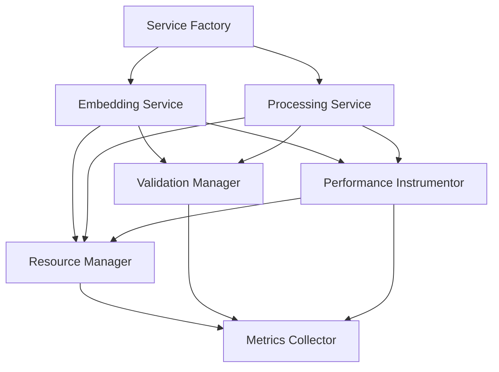
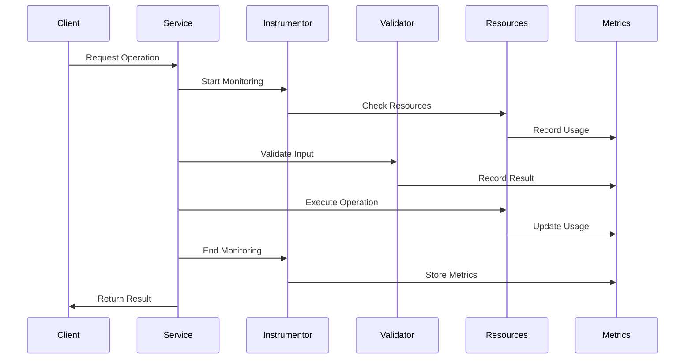
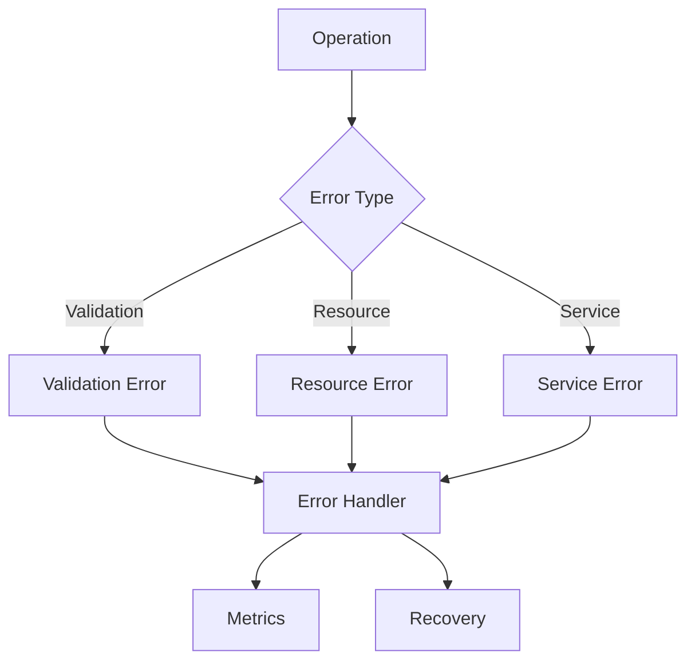
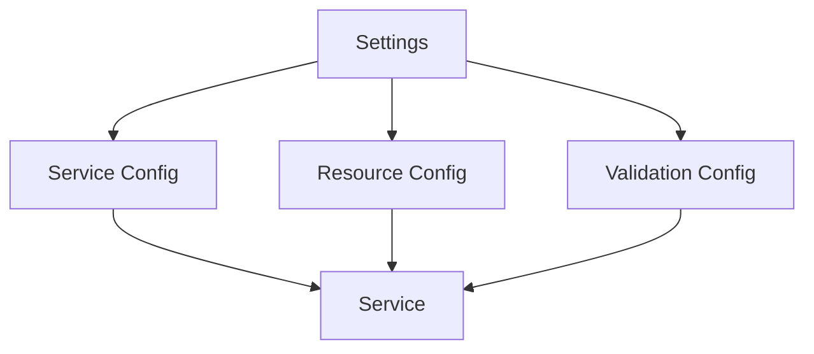
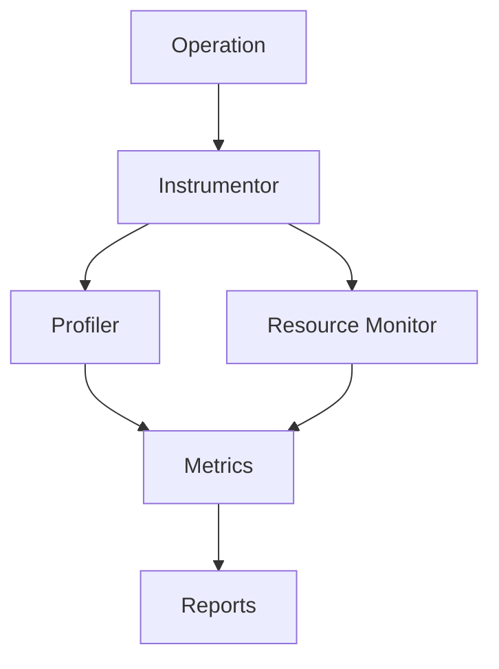
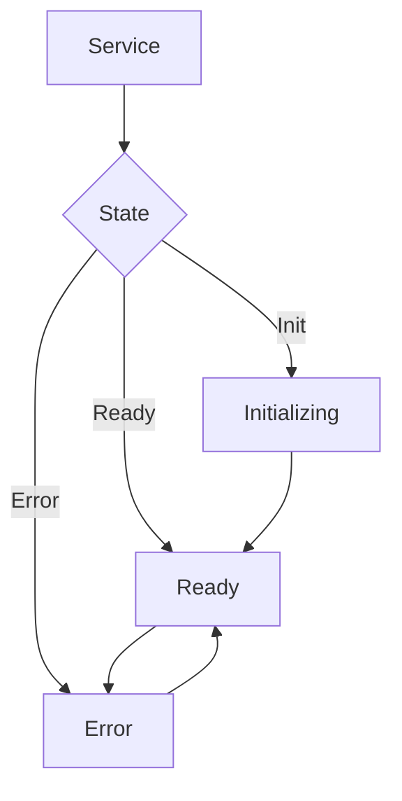

# ML Services Component Relationships

## Overview

This document describes the relationships and interactions between components in the ML services layer.

## Core Dependencies



## Component Interactions

### Service Layer

1. **Service Factory → Service Implementations**

   - Creates service instances
   - Configures dependencies
   - Initializes resources
   - Sets up validation

2. **Services → Resource Manager**

   - Monitors resource usage
   - Manages memory allocation
   - Controls batch sizes
   - Handles GPU resources

3. **Services → Validation Manager**

   - Validates inputs
   - Checks resource constraints
   - Verifies batch parameters
   - Ensures state consistency

4. **Services → Performance Instrumentor**
   - Tracks operation metrics
   - Profiles resource usage
   - Monitors performance
   - Generates alerts

### Monitoring Layer

1. **Performance Instrumentor → Metrics Collector**

   - Records operation metrics
   - Tracks resource usage
   - Stores performance data
   - Generates reports

2. **Resource Manager → Metrics Collector**

   - Reports resource utilization
   - Tracks memory usage
   - Monitors batch sizes
   - Records GPU metrics

3. **Validation Manager → Metrics Collector**
   - Logs validation results
   - Tracks error rates
   - Records batch statistics
   - Reports validation metrics

## Data Flow



## Resource Management

1. **Memory Management**

   ```mermaid
   graph LR
       A[Resource Manager] --> B[Memory Monitor]
       A --> C[GPU Monitor]
       B --> D[Metrics]
       C --> D
       B --> E[Batch Sizing]
       C --> E
   ```

2. **Batch Processing**
   ```mermaid
   graph LR
       A[Batch Processor] --> B[Resource Check]
       A --> C[Validation]
       B --> D[Execution]
       C --> D
       D --> E[Metrics]
   ```

## Validation Flow

1. **Input Validation**

   ```mermaid
   graph LR
       A[Service] --> B[Validator]
       B --> C[Content Check]
       B --> D[Resource Check]
       C --> E[Result]
       D --> E
   ```

2. **Batch Validation**
   ```mermaid
   graph LR
       A[Service] --> B[Batch Validator]
       B --> C[Size Check]
       B --> D[Memory Check]
       C --> E[Result]
       D --> E
   ```

## Error Handling



## Configuration Flow



## Metrics Collection



## State Management



## Testing Relationships

1. **Unit Tests**

   - Individual component tests
   - Mock dependencies
   - Isolated validation
   - Error handling checks

2. **Integration Tests**

   - Component interaction tests
   - Resource management validation
   - End-to-end workflows
   - Performance verification

3. **Performance Tests**
   - Resource usage patterns
   - Batch processing efficiency
   - Memory management
   - Error recovery impact
